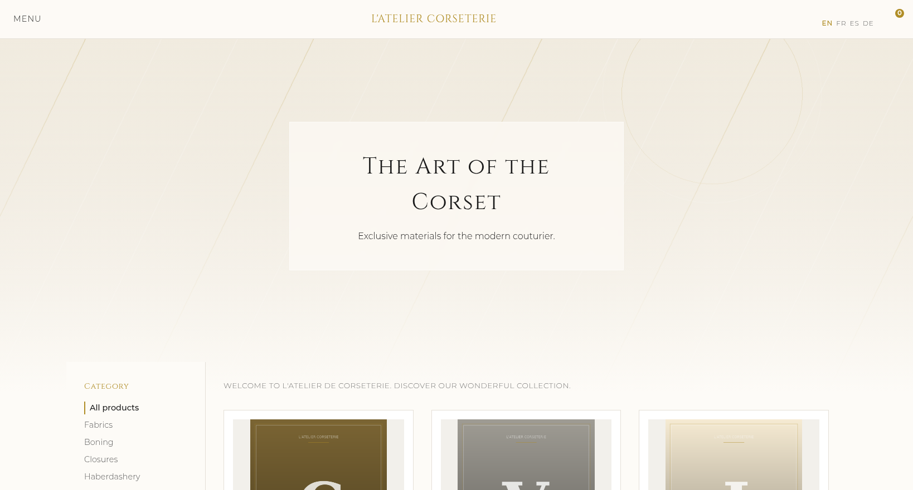

# Phlo Webshop demo

A full feature **webshop** built with the [Phlo](https://github.com/q-ainl/phlo) framework:
a multilingual storefront (English, French, Spanish and German) for fine corsetry
supplies, with a schema-driven [Phlo CMS](https://github.com/q-ainl/phlo-cms) admin.
The whole dataset lives in one committed SQLite file, so `docker compose up` gives you
a populated shop and a working back office.



## What it shows

- **A real shop flow.** Category tree with subcategories, colour and material
  filters, product pages with variants and live stock hints, a session cart with
  async quantity updates, and a demo checkout that stores real orders (nothing is
  shipped or charged).
- **Four languages, three layers.** Interface strings translate through the `lang`
  resource (`{en: ...}` with pre-seeded `langs/fr|es|de.ini`), catalogue content
  through `*_translations` tables with localised URIs (`/fr/produit/...`,
  `/de/produkt/...`), and section slugs per language in the router. With an OpenAI
  key in `creds.ini` the admin auto-translates new products on save.
- **One app, two faces.** The storefront and the CMS admin are one Phlo app on one
  SQLite file. The storefront is dispatched manually (no route nodes), the admin is
  the standard Phlo CMS route set, selected by hostname or listening port. The CMS
  comes in as a Composer dependency; the admin itself is generated from
  `static schema => arr(field(type: ...))` declarations in `modules/`.
- **A dashboard that means something.** Revenue per day, average order value,
  revenue per category and best sellers, computed by widgets on the seeded orders.
- **Drag-to-sort categories.** `CMS.list.sort.phlo` shows how an app extends a CMS
  list view with its own variant.

## Run it

The Docker image bundles the Phlo engine; Composer pulls the CMS into `vendor/`:

```sh
composer install
docker compose up
# shop:  http://localhost
# admin: http://localhost:8081
```

Port taken, or running a second demo next to this one? Pick any port: `PORT=8080 ADMIN_PORT=8082 docker compose up` and open http://localhost:8080.

The committed dataset (`data/shop.db` plus the generated product imagery under
`data/uploads/`) is in place, so the shop is populated on first load. The first
request transpiles the `.phlo` sources into `php/` automatically (`build: true`).

## The admin

The Phlo CMS admin answers on its own root: port `8081` locally, a
`demo.admin.*` hostname in a deployment, or force it with `PHLO_ADMIN=1`.
`/admin` on the shop points you to the right address. It is open by default for
local play; copy `data/creds.example.ini` to `data/creds.ini` to protect it with
HTTP basic auth (`[dashboard]` user/password) before exposing it.

## Reseed

The seeder is deterministic and dependency-free (GD for the imagery):

```sh
php www/app.php seed::run
```

This drops and recreates every table, refills the catalogue (categories,
products, variants, stock and their fr/es/de translations), regenerates the
product imagery, spreads a year of demo orders and rewrites `langs/*.ini`.

## Without Docker

Serve `www/` with any PHP server (FrankenPHP, `php -S 127.0.0.1:8080 www/app.php`,
Caddy `php_server`). `www/app.php` uses the Composer-installed engine
(`vendor/phlo/tech`) when present, and otherwise looks for it at `/phlo`; point it
elsewhere with the `PHLO_ENGINE` environment variable. Run the admin next to it
with `PHLO_ADMIN=1 php -S 127.0.0.1:8081 www/app.php`.

## Layout

```
app.phlo             # shared props + the shop/admin dispatch + CMS menu
shop.phlo            # storefront router: localised slugs, no route nodes
entity.phlo          # base model: SQLite file + translation sync
modules/*.phlo       # the shop models (CMS schema + shop props)
page.*.phlo          # storefront pages (home, products, product, cart, ...)
layout.phlo          # navbar, mobile nav, hero, footer, language switch
listing.phlo         # product grid and related-products cards
style.shop.phlo      # the storefront stylesheet
CMS.list.sort.phlo   # drag-to-sort list view for the categories
seed.phlo            # deterministic seeder (schema, catalogue, orders, langs)
data/shop.db         # the committed SQLite dataset
data/uploads/        # committed product imagery (regenerated by the seeder)
langs/*.ini          # committed interface translations (fr, es, de)
data/app.json        # wires the CMS resources, fields and SQLite driver
composer.json        # the CMS itself: phlo/cms, installed into vendor/
www/app.php          # the entry point (host, paths, build flags)
```

## License

MIT.
